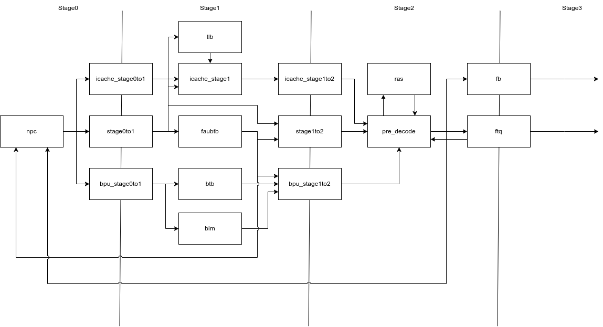

# KXCore 项目文档

## 概述

KXCore 是一个基于 la32r 指令集的乱序多发射 CPU, 支持3发射队列，双提交...同时具有分支预测，Cache等优化设计。（性能结果）

//指令支持
我们实现了 loongarch32 精简版，支持常见相关csr, （中断、接口、AXI） 

我们实现了 LoongArch32 精简版，支持：
- **基础指令集**：包含算术运算、逻辑运算、移位、分支跳转等指令
- **访存指令**：支持字节、半字、字的加载存储操作
- **系统指令**：ERTN、IDLE、IBAR、DBAR等特权指令
- **CSR操作**：CSRRD、CSRWR、CSRXCHG等控制状态寄存器指令
- **TLB操作**：TLBSRCH、TLBRD、TLBWR、TLBFILL、INVTLB等
- **中断异常处理**：完整的异常处理机制和中断控制
- **AXI总线接口**：支持标准AXI4协议

### 核心参数
- **数据位宽**：32位
- **发射宽度**：双发射 (coreWidth = 2)
- **取指宽度**：4路取指 (fetchWidth = 4)
- **退休宽度**：单周期退休 (retireWidth = 1)
- **物理寄存器**：80个物理寄存器，32个逻辑寄存器
- **ROB大小**：32个条目的重排序缓冲区

## 总体架构

KXCore 使用了前后端架构，前端4阶段，后端6阶段。

前端采用4级流水线设计，包含以下阶段：

#### Stage 0-1: 取指阶段 ([`ICache`](IP/KXCore/common/src/KXCore/common/peripheral/ICache.scala))
- **PC生成**：支持顺序取指和分支重定向
- **分支预测**：集成的分支预测单元
- **ICache访问**：指令缓存访问请求

#### Stage 1-2: 预译码阶段 ([`FrontEnd.scala`](IP/KXCore/superscalar/src/KXCore/superscalar/core/frontend/FrontEnd.scala))
- **指令预译码**：识别分支指令类型和控制流指令
- **分支预测验证**：验证分支预测结果
- **重定向处理**：处理分支预测错误和后端重定向

#### 关键组件：
- **取指缓冲区 (FetchBuffer)**：16个条目，用于缓冲取指结果
- **取指目标队列 (FTQ)**：32个条目，管理取指目标和分支信息
- **分支预测器**：包含BIM、BTB、RAS等多级预测结构

### 前端设计

前端分为 xx 阶段。

### 后端设计

后端采用6级流水线设计，支持乱序执行：

#### Stage 1: 译码阶段 ([`Decoder`](IP/KXCore/superscalar/src/KXCore/superscalar/core/backend/Decoder.scala))
- **指令译码**：将指令译码为微操作(MicroOp)
- **操作数识别**：识别源寄存器和目标寄存器
- **功能单元分配**：确定指令需要的执行单元类型

#### Stage 2: 重命名阶段 ([`Rename`](IP/KXCore/superscalar/src/KXCore/superscalar/core/backend/RenameMapTable.scala))
- **寄存器重命名**：逻辑寄存器到物理寄存器的映射
- **依赖关系解析**：建立指令间的数据依赖关系
- **物理寄存器分配**：从空闲列表分配物理寄存器

#### Stage 3: 分发阶段 ([`Dispatch`](IP/KXCore/superscalar/src/KXCore/superscalar/core/backend/BasicDispatcher.scala))
- **ROB分配**：为指令分配重排序缓冲区条目
- **发射队列选择**：根据指令类型分发到对应发射队列
- **资源可用性检查**：确保有足够资源处理指令

#### Stage 4: 发射阶段
KXCore配置了3个专用发射队列：

1. **内存发射队列 (MEM IQ)**：
   - 处理所有访存指令 (LD/ST)
   - 发射宽度：1，队列深度：12
   
2. **通用发射队列 (UNQ IQ)**：
   - 处理特殊指令 (CSR操作、系统指令等)
   - 发射宽度：1，队列深度：8
   
3. **整数发射队列 (INT IQ)**：
   - 处理整数运算指令 (ALU操作)
   - 发射宽度：2，队列深度：8

#### Stage 5: 执行阶段
- **ALU单元**：2个ALU执行单元，支持并行计算
- **访存单元**：集成DCache的内存执行单元
- **乘法器**：3级流水线乘法器
- **除法器**：支持除法运算的专用单元

#### Stage 6: 写回阶段
- **结果写回**：执行结果写回物理寄存器文件
- **唤醒机制**：唤醒等待的相关指令
- **异常处理**：处理执行阶段产生的异常

#### Stage 7: 提交阶段 ([`ReorderBuffer`](IP/KXCore/superscalar/src/KXCore/superscalar/core/backend/ReorderBuffer.scala))
- **按序提交**：保证指令按程序顺序提交
- **异常处理**：处理异常和中断
- **分支重定向**：处理分支预测错误
- **架构状态更新**：更新架构可见的处理器状态

## 关键优化设计

### 分支预测机制
- **分支指令缓冲区 (BIM)**：2048组的分支历史表
- **分支目标缓冲区 (BTB)**：128组2路组相联
- **返回地址栈 (RAS)**：32条目的函数调用栈
- **微BTB (μBTB)**：16路的快速分支预测

### 缓存系统
- **指令缓存 (ICache)**：支持指令预取和缓存一致性
- **数据缓存 (DCache)**：3级流水线设计，支持写回策略
- **TLB**：16个条目的快表，支持虚拟地址转换

### 乱序执行特性
- **物理寄存器重命名**：80个物理寄存器消除WAR和WAW冲突
- **动态调度**：基于数据依赖的乱序发射
- **推测执行**：支持分支预测的推测执行
- **精确异常**：通过ROB保证精确异常处理

